# Deployment

Once your app is fully developed and tested, follow the steps below to deploy it to the Play Store and App Store. Each platform has specific requirements and guidelines you'll need to follow for a successful deployment.

- [Google Play Store Deployment](#google-play-store-deployment)
- [iOS App Store Deployment](#ios-app-store-deployment)
- [Android Developer Verification — Package Name Registration](#android-developer-verification--package-name-registration)

---

# Google Play Store Deployment

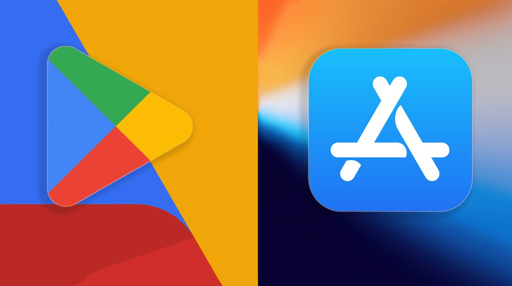

## Prerequisites

Before starting the deployment process, ensure you have:

1. A Google Play Developer Account ($25 one-time fee)
2. Your Flutter app ready for release
3. Basic understanding of using the command line/terminal
4. Required assets:
   - App icon (512x512 px)
   - Feature graphic (1024x500 px)
   - Screenshots for different devices (Phone, Tablet)
   - Privacy policy URL
   - Short description (up to 80 characters)
   - Full description (up to 4000 characters)
   - Promotional video (optional)

## Step-by-Step Guide

### 1. Developer Account Setup

1. Visit [Google Play Console](https://play.google.com/console).
2. Choose your account type:
   - Individual developer (additional testing requirements)
   - Organization (requires D-U-N-S Number)
3. Complete registration:
   - Pay the $25 registration fee
   - Verify your identity
   - Set up a payment profile
   - Provide contact information
   - Accept the developer agreement
4. For Organization accounts:
   - Obtain a D-U-N-S Number (takes 1-30 business days)
   - Submit business verification documents
   - Provide organization details

### 2. App Configuration

Before building your app, update these files:

#### Update pubspec.yaml

```yaml
version: 1.0.0+1  # Format: version_name+version_code
```

> **Important Version Note:**
> - The version format is `version_name+version_code` (e.g., `1.0.0+1`)
> - `version_name` (1.0.0): The public version number shown to users
> - `version_code` (1): Internal version number used by the Play Store
> - **For every new release**, you MUST increment the `version_code` by at least 1
> - Example sequence:
>   - First release: `1.0.0+1`
>   - Bug fix update: `1.0.1+2`
>   - Feature update: `1.1.0+3`
>   - Major update: `2.0.0+4`

#### Configure Android Manifest

Navigate to `android/app/src/main/AndroidManifest.xml`:

```xml
<manifest xmlns:android="http://schemas.android.com/apk/res/android">
    <application
        android:label="Your App Name"
        android:icon="@mipmap/ic_launcher">
        <!-- Your app configuration -->
    </application>
</manifest>
```

### 3. Generate App Signing Key

1. Open a terminal in the project directory.
2. Run the command:

   **For Mac/Linux**

   ```
   keytool -genkey -v -keystore YOUR-KEYSTORE-FILE.jks -keyalg RSA -keysize 2048 -validity 10000 -alias YOUR-ALIAS
   ```

   **For Windows**

   ```
   keytool -genkey -v -keystore YOUR-KEYSTORE-FILE.jks -storetype JKS -keyalg RSA -keysize 2048 -validity 10000 -alias YOUR-ALIAS
   ```

3. Follow the prompts to create the keystore:
   - Enter a password
   - Provide your details
   - Confirm the information
4. Store the keystore file securely.
5. Make backup copies of the keystore.

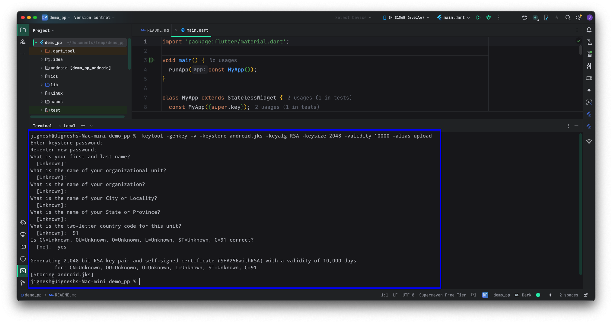

### 4. Configure Key Properties

Create a `key.properties` file in the `android` folder:

```properties
storePassword=<your keystore password>
keyPassword=<your key password>
keyAlias=upload
storeFile=<path to your keystore file>
```

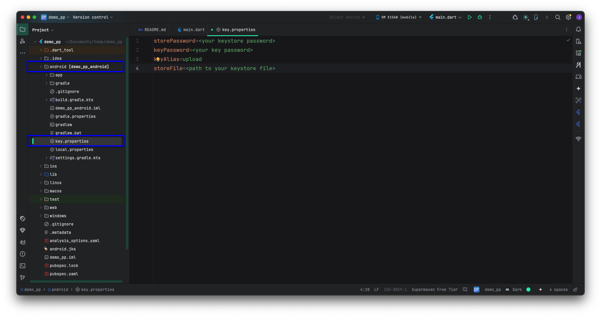

:::note Android Developer Verification
Once your signing key is generated, you'll need to register your package name and signing key with Google for developer verification. See [Android Developer Verification — Package Name Registration](#android-developer-verification--package-name-registration) for the full process.
:::

Update `android/app/build.gradle`:

1. Open your `build.gradle` file.
2. Look for the required code blocks:
   - **If present:** No changes needed.
   - **If missing:** Add the required code blocks manually.

```gradle
def keystoreProperties = new Properties()
def keystorePropertiesFile = rootProject.file('key.properties')
if (keystorePropertiesFile.exists()) {
    keystoreProperties.load(new FileInputStream(keystorePropertiesFile))
}
```

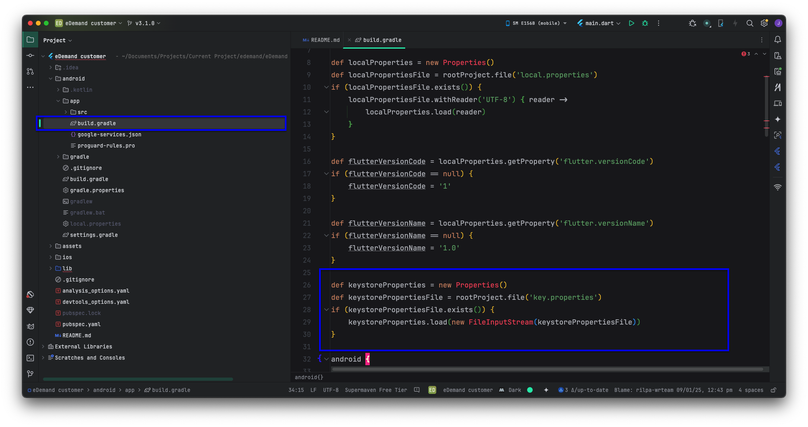

```gradle
signingConfigs {
        release {
            keyAlias keystoreProperties['keyAlias']
            keyPassword keystoreProperties['keyPassword']
            storeFile keystoreProperties['storeFile'] ? file(keystoreProperties['storeFile']) : null
            storePassword keystoreProperties['storePassword']
        }
    }
```

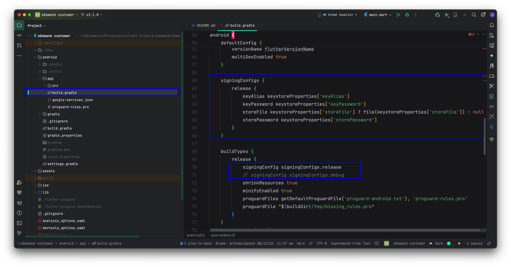

```gradle
signingConfig signingConfigs.release
```

3. Save the file.
4. Sync your project to apply the changes.

### 5. Build Your App

1. Open a terminal in the project directory.
2. Run the command:

   ```bash
   flutter build appbundle --release
   ```

3. Optional flags:
   - `--obfuscate` — To protect your code
   - `--split-debug-info` — For crash reporting
4. Wait for build completion.
5. Find the app bundle at: `build/app/outputs/bundle/release/app.aab`

### 6. App Setup

#### Create App Listing

1. Go to the Play Console.
2. Click **Create app**.
3. Fill in the basic information:
   - App name
   - Default language
   - App/game category
   - Free/paid status
   - Declaration of app content

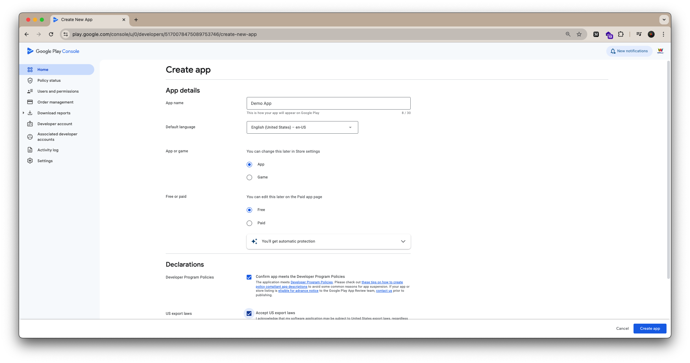

#### Complete Store Listing

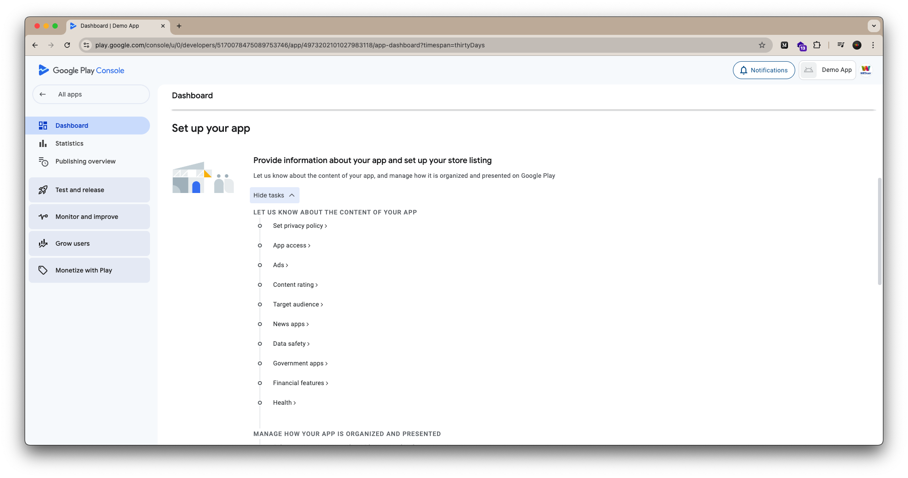

#### Let Us Know About the Content of Your App

Complete each of the following sections in the Play Console: Privacy Policy, App Access, Ads Declaration, Content Rating, Target Audience, News Apps (if applicable), Data Safety, Government Apps (if applicable), Financial Apps (if applicable), Health Apps (if applicable), and Categorization.

- **Set Privacy Policy** — Required for all apps; must be accessible without login and include data collection/usage, security practices, data deletion policies, and contact information.
- **App Access** — Specify if the app requires login; provide test account credentials if needed.
- **Ads Declaration** — Indicate if your app contains ads and the types of ads used.
- **Content Rating** — Complete the questionnaire (violence, sexual content, language, controlled substances, etc.).
- **Target Audience** — Select target age groups.
- **Data Safety** — Declare all data collection, usage, security measures, and sharing practices.
- **Categorization** — Primary category, tags/keywords, and contact details (email, phone, website).

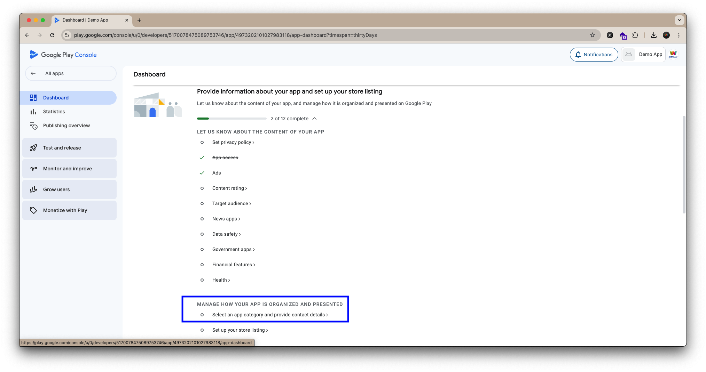

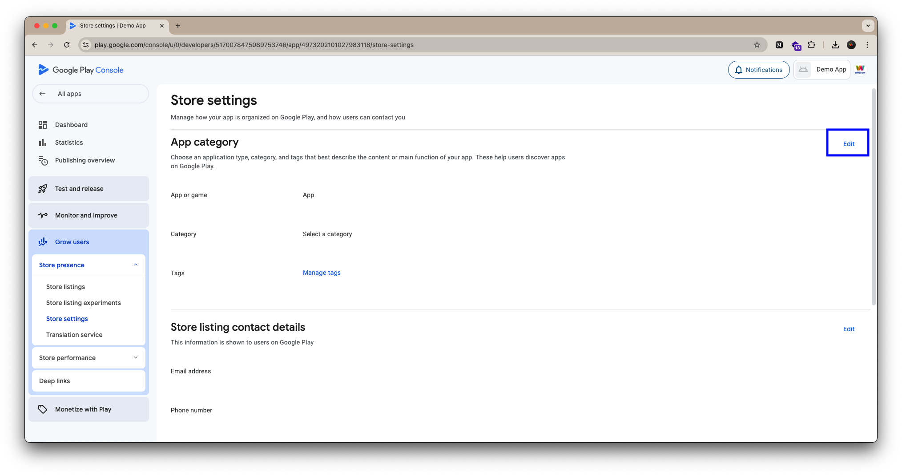

#### Store Listing Details

- App name (30 characters max)
- Short description (80 characters max)
- Full description (4000 characters max)
- What's new in this release

**Visual Assets**

- App icon: 512x512 px PNG, max 1MB
- Feature graphic: 1024x500 px, JPG or PNG, max 15MB
- Screenshots:
  - Phone (minimum 2): 16:9 aspect ratio, minimum 1920x1080 px
  - Tablet (if supported): 16:9 aspect ratio, minimum 2048x1536 px

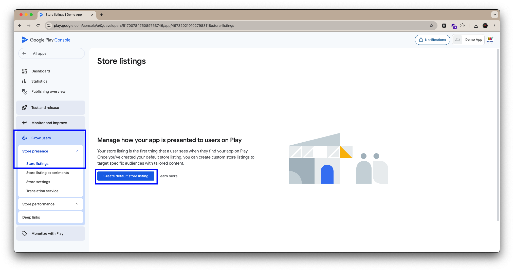

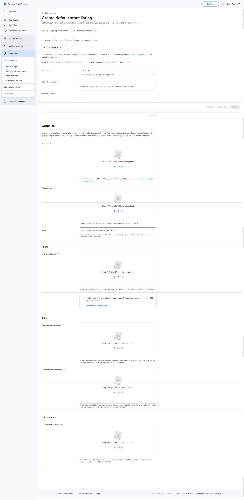

**Languages and Translations**

- Default language selection
- Additional language support
- Localized store listings (translated descriptions and language-specific screenshots)

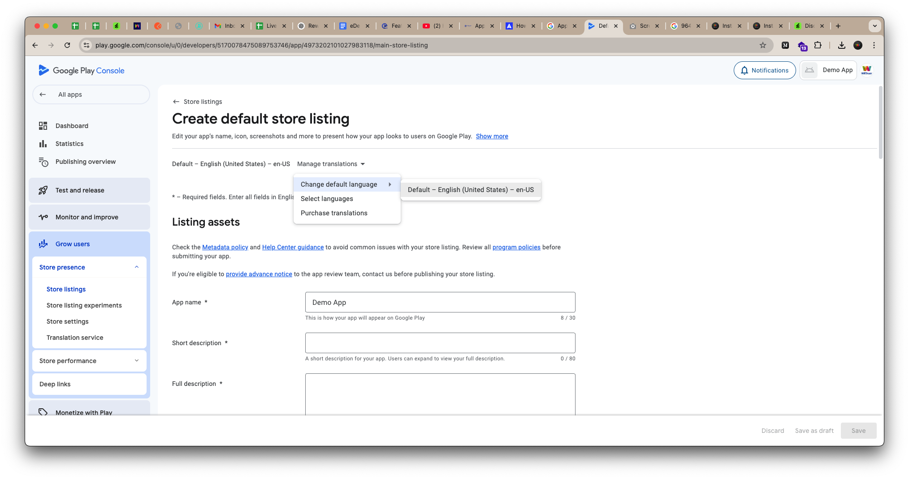

### 7. Testing Setup

#### Understanding Testing Requirements

For personal developer accounts created after November 13, 2023, you must meet specific testing requirements before publishing:

- Run a closed test with a minimum of 12 testers
- Testers must be opted in for at least 14 consecutive days
- Complete an application process for production access

#### Testing Tracks Overview

1. **Internal Testing** — Quick distribution to trusted testers; builds available within seconds; no specific requirements to access.
2. **Closed Testing** — Testing with a controlled user group; requires completed app setup, minimum 12 opted-in testers, and 14 consecutive days of testing.
3. **Open Testing** — Public testing on Google Play; requires production access.
4. **Production** — Full public release; requires successful closed testing and approved production access.

### 8. Production Release

1. Create a production track.
2. Select countries.
3. Upload the app bundle.
4. Add release notes (what's new, bug fixes, improvements).
5. Configure the rollout percentage.
6. Review all sections (store listing, content rating, data safety, app content).
7. Submit for review.

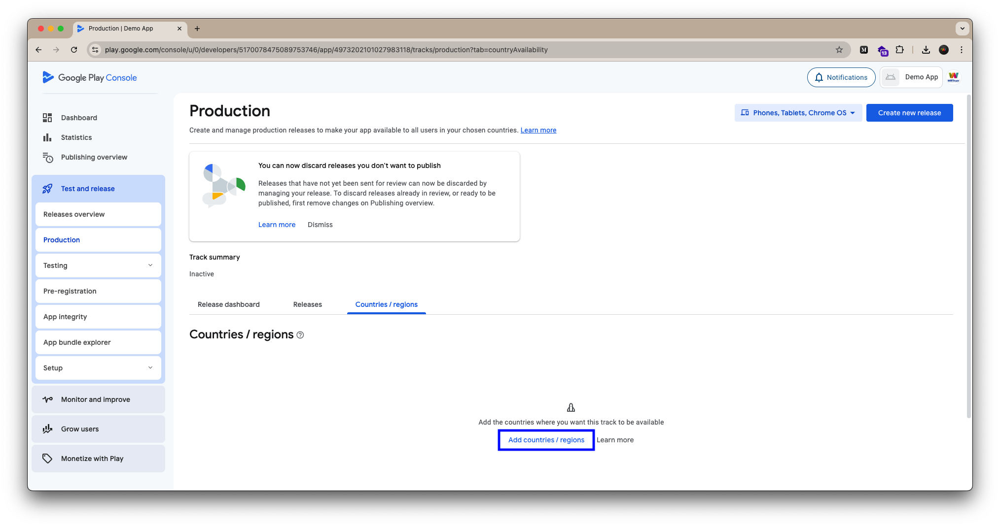

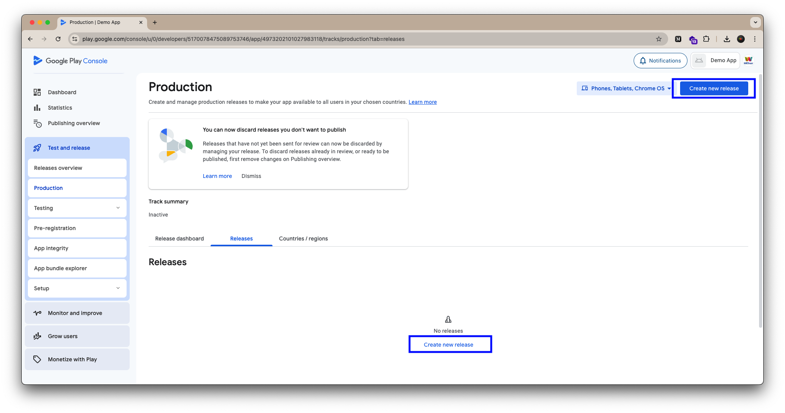

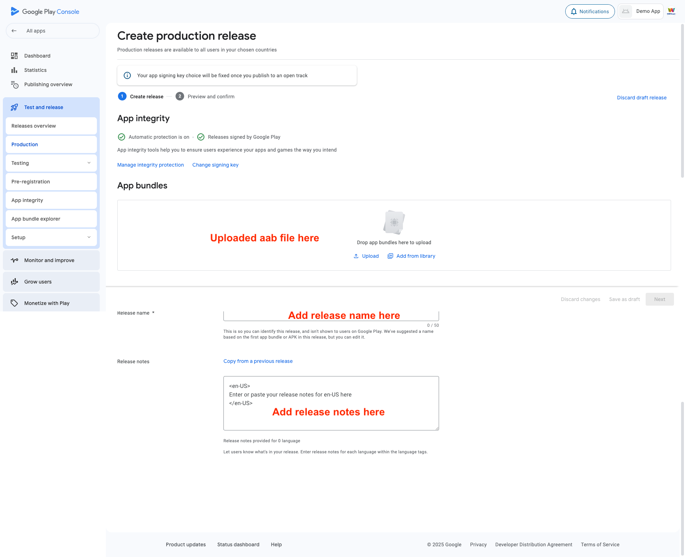

### 9. Post-Release Tasks

1. Monitor app performance.
2. Track user feedback.
3. Address bug reports.
4. Plan updates.
5. Maintain compliance.

---

# iOS App Store Deployment

## Prerequisites

Before starting the iOS deployment process, ensure you have:

1. Apple Developer Account ($99/year)
2. Your Flutter app ready for release
3. A Mac computer with Xcode installed
4. Required assets:
   - App icon (1024x1024 px)
   - Screenshots for different devices (iPhone, iPad)
   - Privacy policy URL
   - App description
   - Keywords
   - Support URL
   - Marketing URL (optional)
   - App Store Connect account setup

## Step-by-Step Guide

### 1. Developer Account Setup

1. Visit [Apple Developer Program](https://developer.apple.com/programs/).
2. Enroll in the program:
   - Pay the $99 annual fee
   - Complete organization verification
   - Set up a payment profile
   - Provide contact information
3. Configure App Store Connect:
   - Create an app record
   - Set up basic information
   - Configure app capabilities

### 2. App Configuration

Before building your app, update these files:

#### Update pubspec.yaml

```yaml
version: 1.0.0+1  # Format: version_name+version_code
```

> **Important Version Note:**
> - The version format is `version_name+version_code` (e.g., `1.0.0+1`)
> - `version_name` (1.0.0): The public version number shown to users
> - `version_code` (1): Internal version number used by the App Store
> - **For every new release**, you MUST increment the `version_code` by at least 1

### 3. Generate App Signing Certificate

1. Open Xcode.
2. Go to **Xcode → Settings → Accounts**.
3. Add your Apple ID.
4. Create certificates:
   - Development certificate
   - Distribution certificate
5. Create provisioning profiles:
   - Development profile
   - App Store profile

### 4. Build Your App

1. Open a terminal in the project directory.
2. Run the command:

   ```bash
   flutter build ipa --release
   ```

3. Optional flags:
   - `--obfuscate` — To protect your code
   - `--split-debug-info` — For crash reporting
4. Wait for build completion.
5. Find the IPA file at: `build/ios/ipa/YourApp.ipa`

### 5. App Store Connect Setup

#### Create App Record

1. Log in to [App Store Connect](https://appstoreconnect.apple.com).
2. Click **My Apps**.
3. Click **+** to create a new app.
4. Fill in the basic information:
   - App name
   - Bundle ID
   - SKU
   - User Access

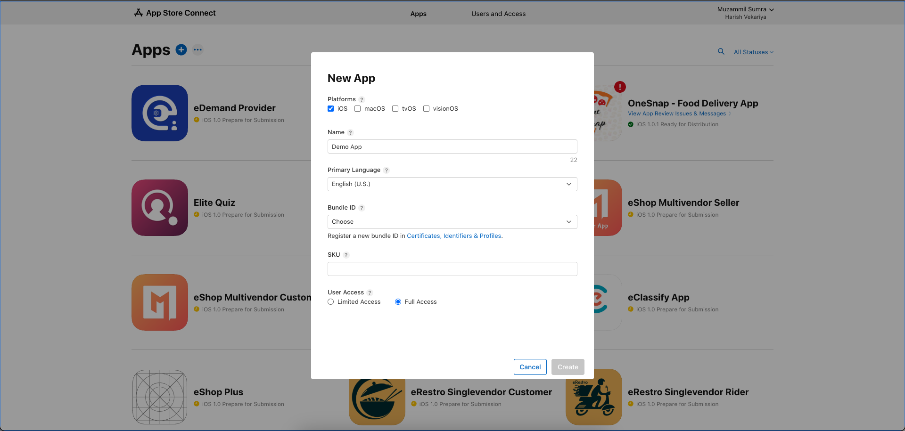

5. Choose or create a Bundle ID:

   :::note
   Bundle ID creation can also be done automatically via Xcode if you enable automatic signing in your project settings.
   :::

   - Click **Certificates, Identifiers & Profiles** in the Apple Developer portal.
   - Go to the **Identifiers** section.
   - Click **+** to register a new Bundle ID if needed.
   - Format: `com.companyname.appname` (e.g., `com.example.myapp`)
   - Select the capabilities required for your app.
   - Register the Bundle ID.
   - Use this Bundle ID in both Xcode and App Store Connect.

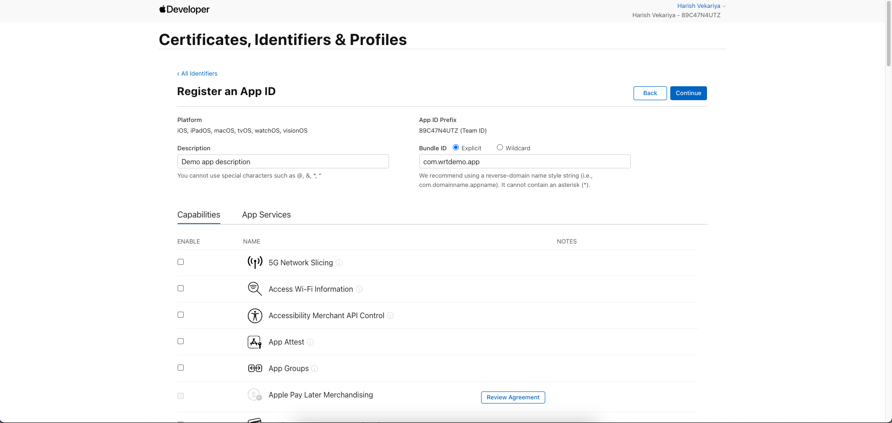
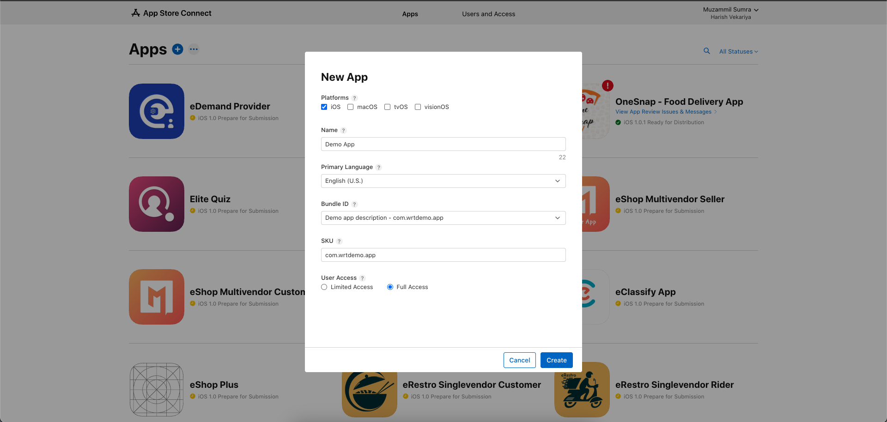

#### Complete App Information

1. App Information:
   - Privacy Policy URL
   - Support URL
   - Marketing URL (optional)
   - App Store category
   - Age rating

   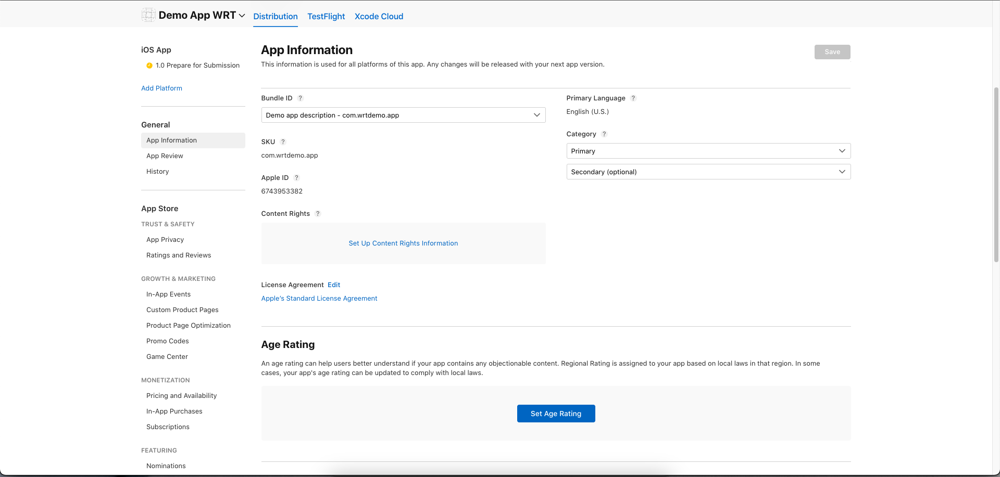

2. Pricing and Availability:
   - Price tier
   - Available territories
   - Release date

   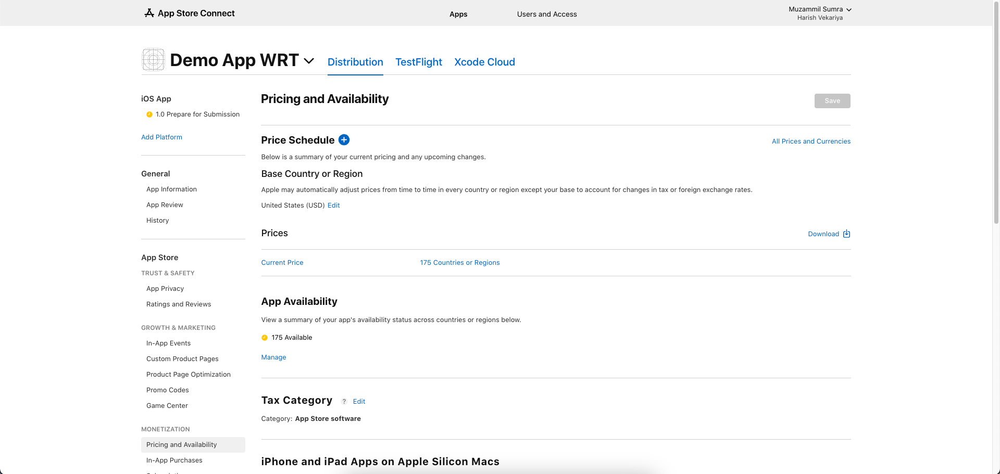

3. App Store Screenshots:
   - iPhone screenshots (6.5" Display)
   - iPad screenshots (if supported)
   - App Preview videos (optional)

   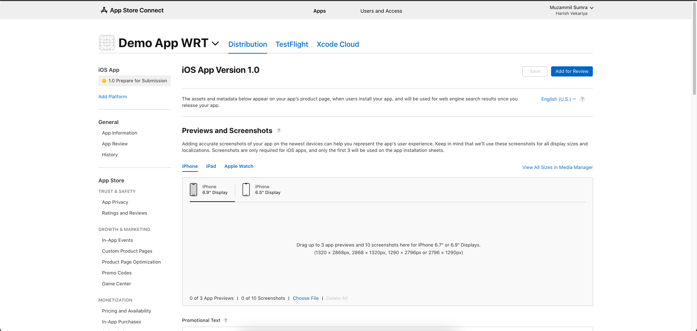

4. App Description:
   - Name (30 characters max)
   - Subtitle (30 characters max)
   - Keywords (100 characters max)
   - Description (4000 characters max)
   - What's New in This Version

5. App Review Information:
   - Contact Information (first name, last name, phone, email)
   - Demo Account (if login required): username/email, password, special instructions
   - Notes for Review Team: app functionality, setup instructions, test account details, known issues

   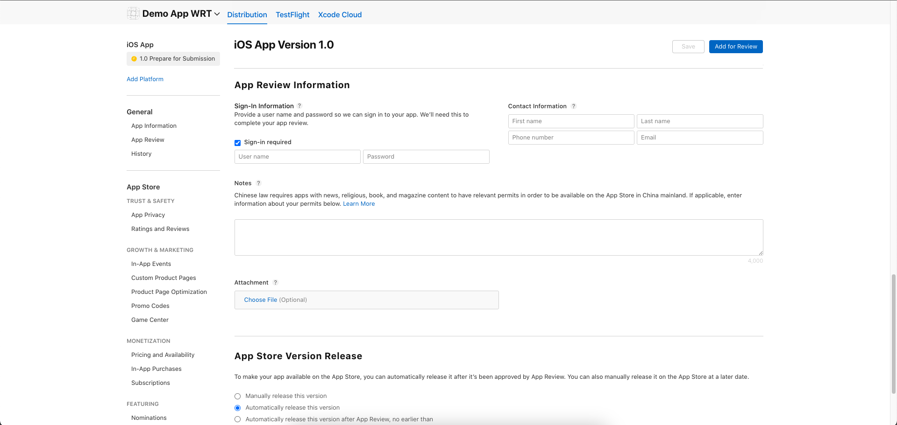

6. App Privacy:
   - Enter the privacy policy URL.
   - Complete the data collection process. If your app requires any data collection, select the respective options.

   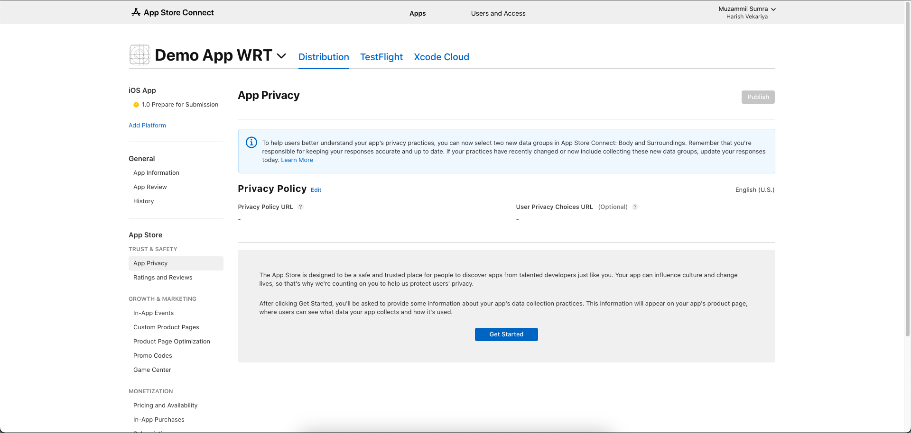

### 6. Production Release

1. Open the iOS folder in Xcode. In the project navigator, select **Runner** under **Targets**, then go to the **Signing & Capabilities** tab. Sign in with your Apple Developer account.

   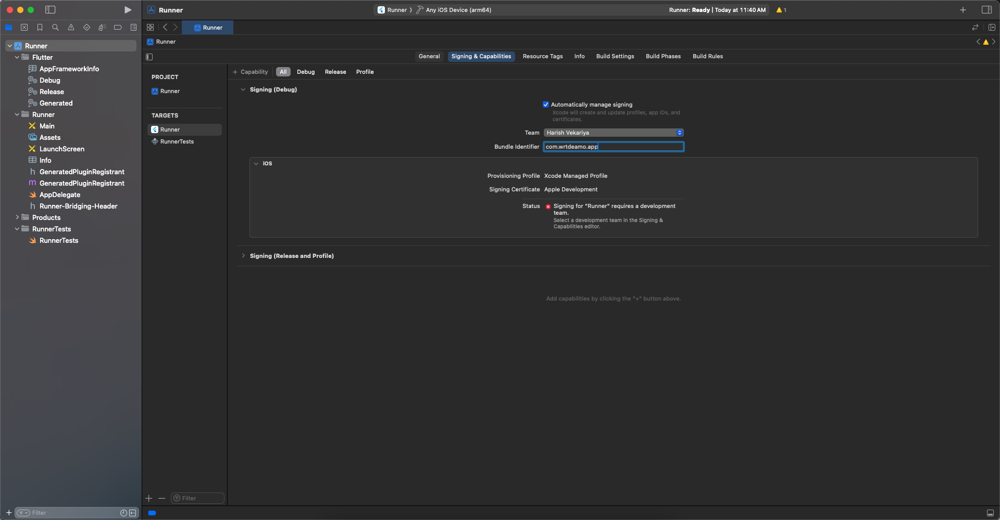

2. Update the version and build number.

   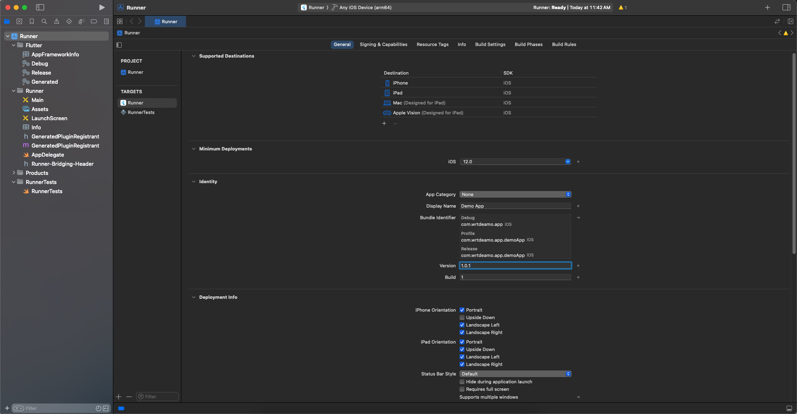

   Then, go to the **Build Settings** tab, scroll down, and update the values for `FLUTTER_BUILD_NAME` and `FLUTTER_BUILD_NUMBER`.

   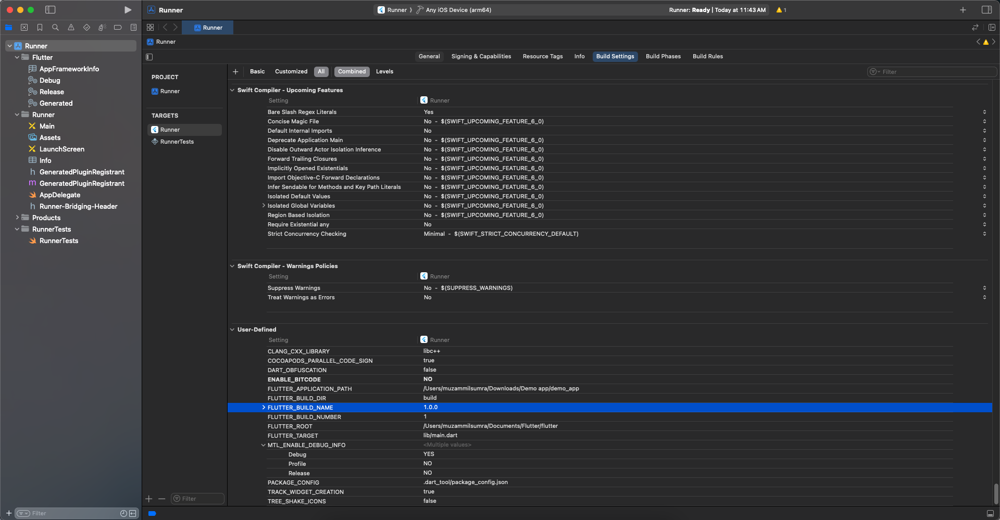

3. Select **Any iOS Device** as the target.

   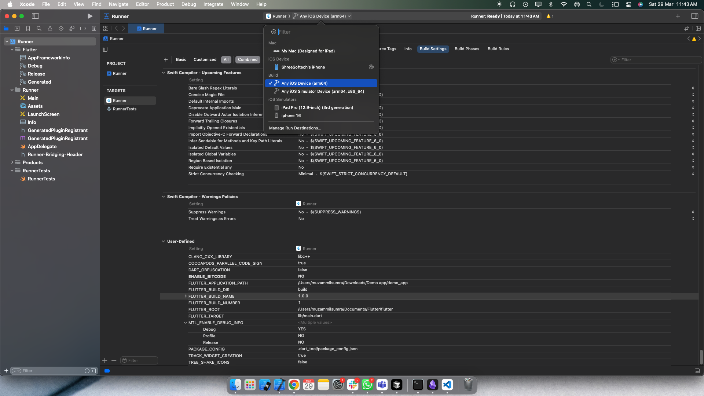

4. To upload the app to the App Store, go to **Product > Archive**. Once the archive is complete, you can proceed with the upload.

   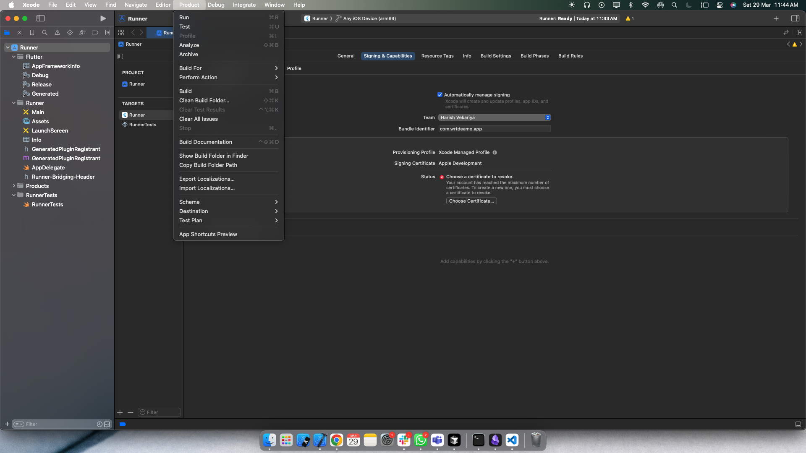

5. Log in to App Store Connect, select the build you uploaded from Xcode, and click **Add for Review** to submit it.

   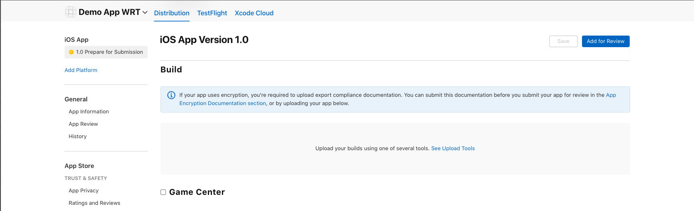

### 7. Post-Release Tasks

1. Monitor app performance.
2. Track user feedback.
3. Address bug reports.
4. Plan updates.
5. Maintain compliance.

## Important Notes

- Keep certificates and provisioning profiles safe.
- Ensure the app complies with App Store guidelines.
- Test thoroughly before submission.
- Keep version numbers updated.
- Monitor review status.
- Back up all signing certificates.

---

# Android Developer Verification — Package Name Registration

How to register an Android package name for developer verification: provide the package details, register your signing key, prove ownership by uploading a signed APK containing the `adi-registration.properties` file, and track the result.

The process differs slightly depending on whether your package name is **new** (never seen on Android) or **existing** (already has installs). This guide covers both.

## Prerequisites

- The release **signing key** and keystore credentials (store password, key alias, key password)
- JDK installed (`keytool` is included)
- Google Play Console access with identity verification already completed
- Your app's **SHA-256 certificate fingerprint**

## Step 1 — Provide Package Name Details

Common to both new and existing package names.

1. Open **Google Play Console** and go to the **Android developer verification** page.
2. On the **Package names** tab, select **Register package name**.
3. Enter the package name you want to register.
4. Provide a friendly name for easy identification within the Play Console.
5. Select **Next** to proceed.

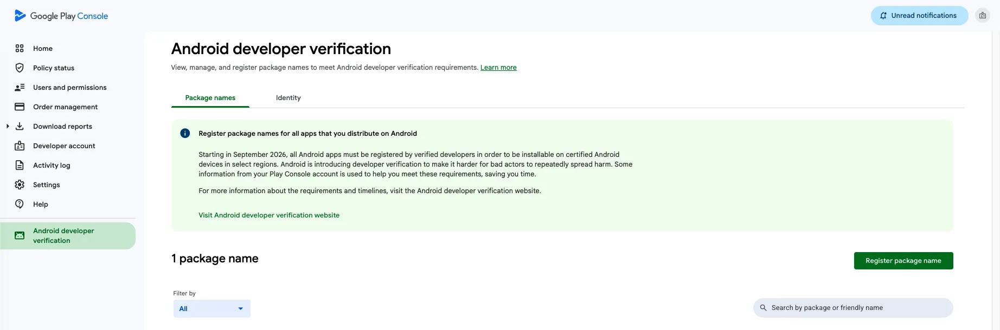

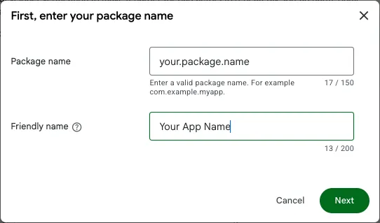

## Step 2 — Register Your Signing Key

The next step depends on whether the package name is new or existing.

### A. New Package Name

For a package name never seen on Android, you only need to provide the public certificate.

1. Select **Add key**.
2. Provide the **public key certificate** from your app's signing key pair.
3. Enter your key and select **Add key**.

### B. Existing Package Name

For a package name that already has installs, you select your key from a list of eligible fingerprints.

1. Select **Select key**.
2. A list of **eligible public certificate fingerprints** is shown — these can be used for direct registration.
3. Scan or search the list for your certificate fingerprint.
4. Select your key and select **Add key**.
5. You return to the registration page, confirming the key has been added.

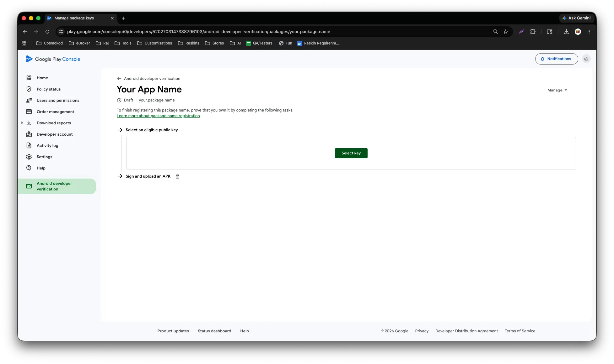

:::note Key not listed as eligible?
Eligibility follows Google's package-sharing rules (majority key holder, 50+ installs, or first-come-first-served). If your fingerprint is not listed, you can expand the **other keys** list and request to use the package name — but this requires submitting a rationale to Google and may be rejected.
:::

## Step 3 — Prove Private Key Ownership (Existing Packages)

Existing package names require an APK signed with the private key as proof of ownership.

### 3.1 Copy the Snippet

1. Select **Upload APK** to open the ownership verification flow.
2. The screen shows the package name, the selected SHA-256 certificate, and signing guidance.
3. Copy the **snippet** — a unique identifier tied to your developer account.


### 3.2 Create the `adi-registration.properties` File

In your project's source tree, create the file at this exact path:

```
android/app/src/main/assets/adi-registration.properties
```

- Create the `assets` folder if it does not already exist.
- The filename must be **exactly** `adi-registration.properties` — no `.txt` extension.

Paste the snippet into the file and save.

:::warning
The path must be exact. If the file is in the project root or any other folder, verification will fail.
:::

### 3.3 Build and Sign the Release APK

```bash
flutter build apk
```

Output: `build/app/outputs/flutter-apk`

Build a **release APK** signed with the **private key** that corresponds to the registered certificate. The signature — via `jarsigner` or Gradle's `signingConfigs` — serves as the proof of ownership.

:::note Delegated signing keys
If the app's private signing key is delegated to a third-party platform (e.g. Samsung Galaxy Store): build and upload your APK/AAB to that platform, download the final signed APK from it, and upload that downloaded APK to the Play Console in Step 3.4.
:::

### 3.4 Upload the APK to Play Console

Return to the verification screen, select **Upload**, locate your signed release APK, and upload it. Android checks the signature and confirms the file contents.

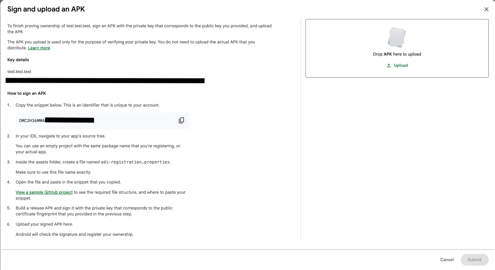

## Step 4 — Track the Registration

Android formally registers the package name and links it to your verified developer identity.

- You receive an **email notification** on successful completion.
- You can monitor key and registration status on the **Android developer verification** page.

## Troubleshooting

| Issue | Cause | Fix |
|-------|-------|-----|
| File not found | File placed in project root, not the assets folder | Move it to `android/app/src/main/assets/` |
| Signature mismatch | APK signed with the wrong / debug key | Sign with the private key matching the registered certificate |
| Wrong filename | File saved with a `.txt` extension | Rename to exactly `adi-registration.properties` |
| Key not eligible | Fingerprint not in the eligible list | Expand **other keys** and submit a request with a rationale |

:::note
For **Expo / managed workflow** projects, the standard JS bundler does not copy files into the native assets folder. Use a config plugin or `prebuild` so the file lands in `android/app/src/main/assets/` inside the final APK.
:::
