# Firebase Billing Setup

To enable certain Firebase services (Phone OTP verification, Places search, Maps APIs beyond the free tier), you must upgrade your Firebase project to the **Blaze (pay-as-you-go) plan** and attach a billing account. Follow **every step in the order shown** below.

## Overview

Firebase provides a range of services, some of which require billing to be enabled, especially OTP login, Google Maps, and the Places API. Follow these steps to ensure proper billing setup.

## Upgrade from the Firebase Spark Plan to the Blaze Plan

:::note
Regarding Firebase OTP setup — if you've already set up the Blaze plan for Firebase OTP previously, there's no need to repeat steps 1 to 3. Please also ensure that your billing account is linked to your app project. If it isn't, kindly follow these steps (points 1 to 3).
:::

1. Log in to the [Firebase Console](https://console.firebase.google.com/u/0/).
   - Open your project in the Firebase Console.
   - In the bottom left, you will see that your project is listed on the Spark plan. Click the upgrade button.

   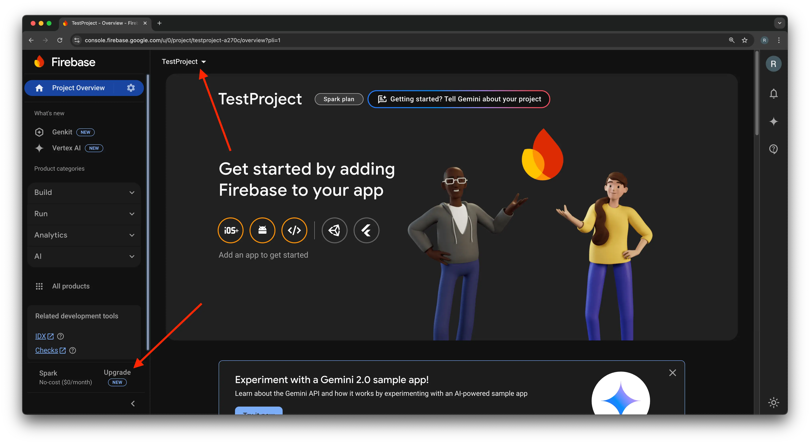

2. Select the Blaze plan.

   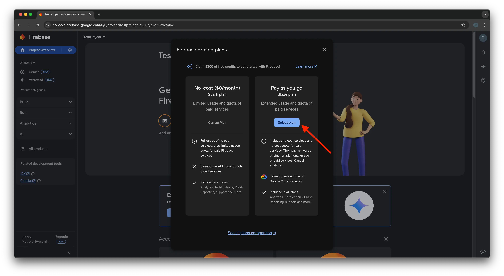

3. Select a billing account. Then click **Continue** and **Purchase**. You are now on the Blaze plan.
   - Select your country instead of India.

     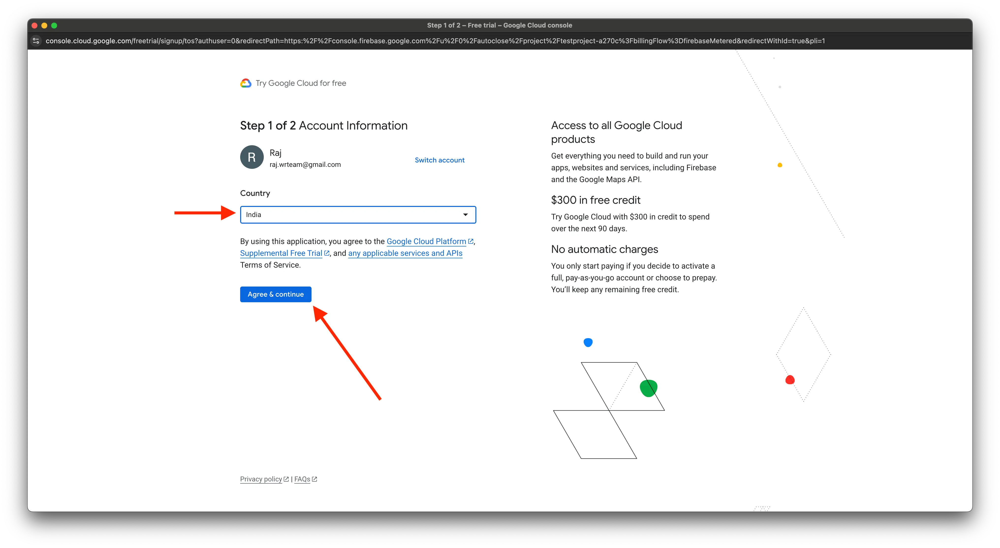
   - Select your existing payment profile, or click **'Create New Payment Profile'** if you don't have one.

     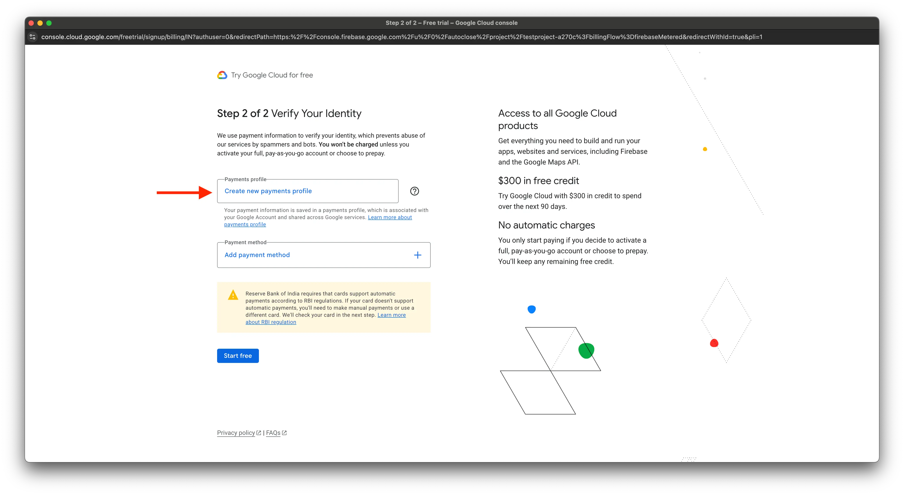
   - Add the details of your payment account.

     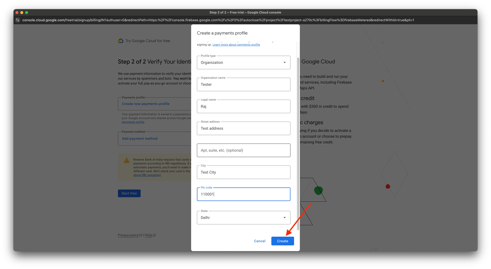
   - Select your existing payment method, or click **'Add Payment Method'** if you don't have one.

     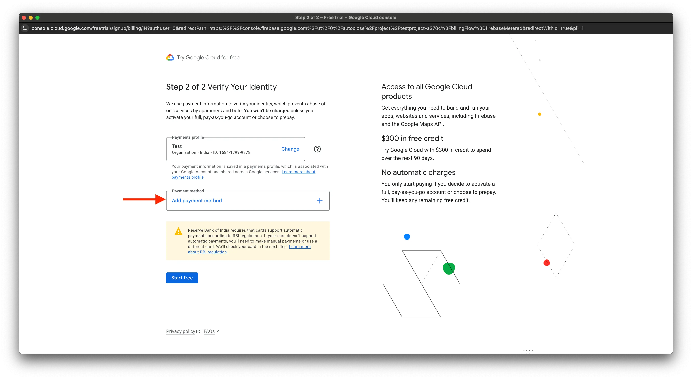
   - Select your payment method.

     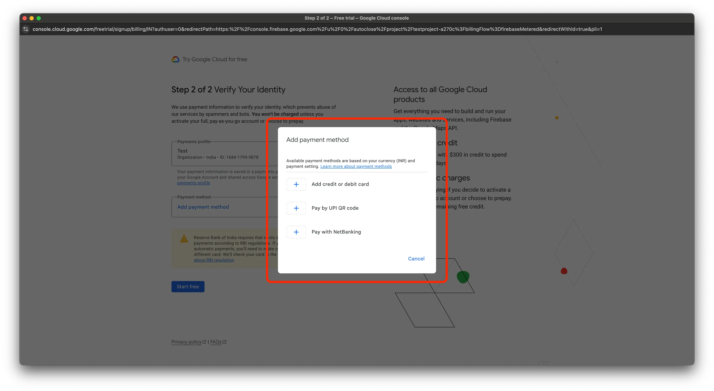

## Setting Up Billing on Map and Place API Keys

### 1️⃣ Set Up Billing

:::note
Regarding Firebase OTP and Maps setup — if you've already set up billing for Firebase OTP previously, there's no need to repeat that step. Please ensure that your billing account is linked to your app project. If it isn't, kindly follow these steps (points 1 to 6).
:::

1. Go to the Firebase Console.
2. Select your project.
3. In the left-hand menu, click on **Project Settings**.
4. Under the **Billing** section, click **Go to Billing Account**.
5. If you don't have a billing account, click **Create Billing Account** and follow the prompts to add your payment method.
6. Link the billing account to your project.

### 2️⃣ Enable Required APIs

1. In the Firebase Console, go to **Project Settings > Cloud Messaging > Manage Service Accounts**.
2. Click on **Google Cloud Console**, then select your project.
3. In the Cloud Console, navigate to **APIs & Services > Library**.
4. Enable the following APIs:
   - **Maps SDK for Android** to display maps on Android devices

     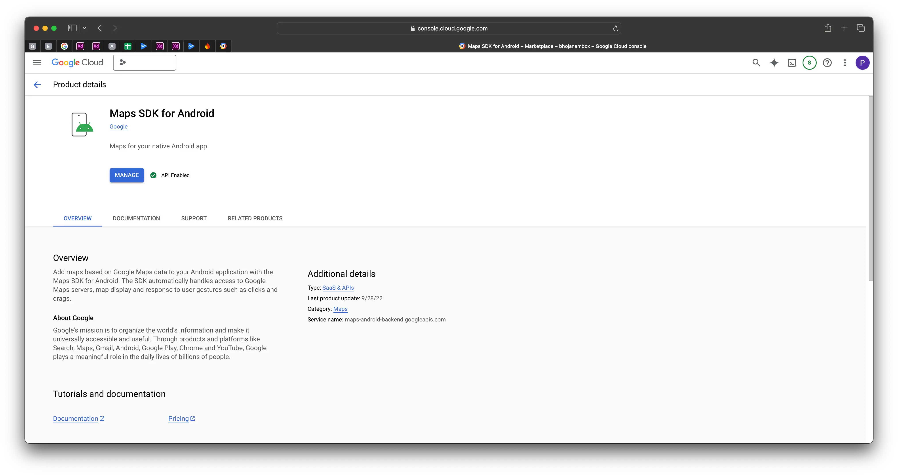
   - **Maps SDK for iOS** to display maps on iOS devices

     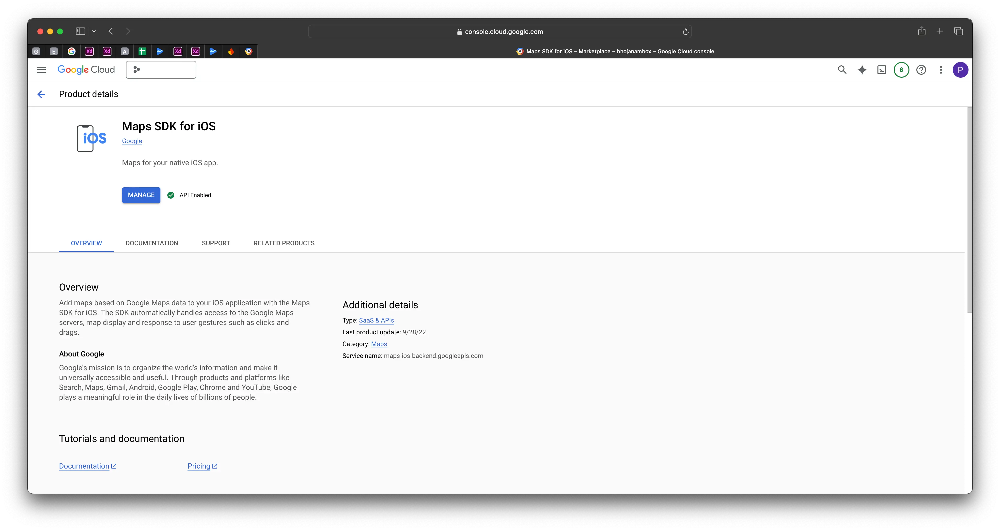
   - **Geocoding API** for converting addresses into coordinates **(optional)**

     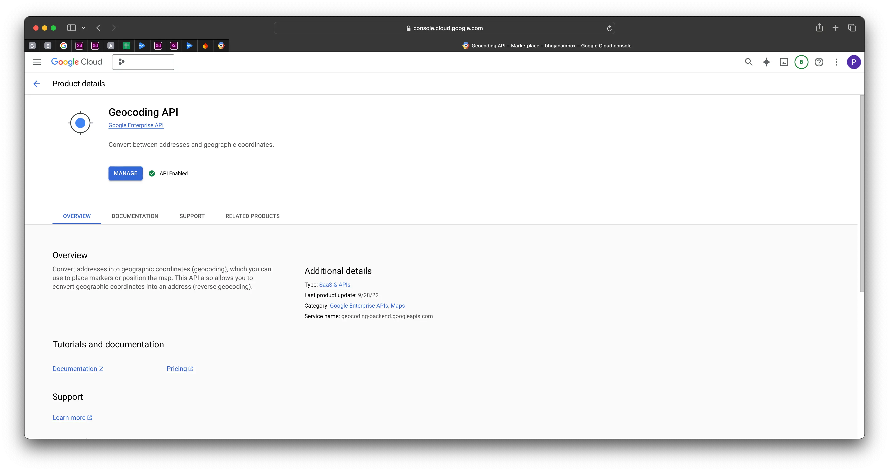
   - **Places API** for location search and autocomplete

     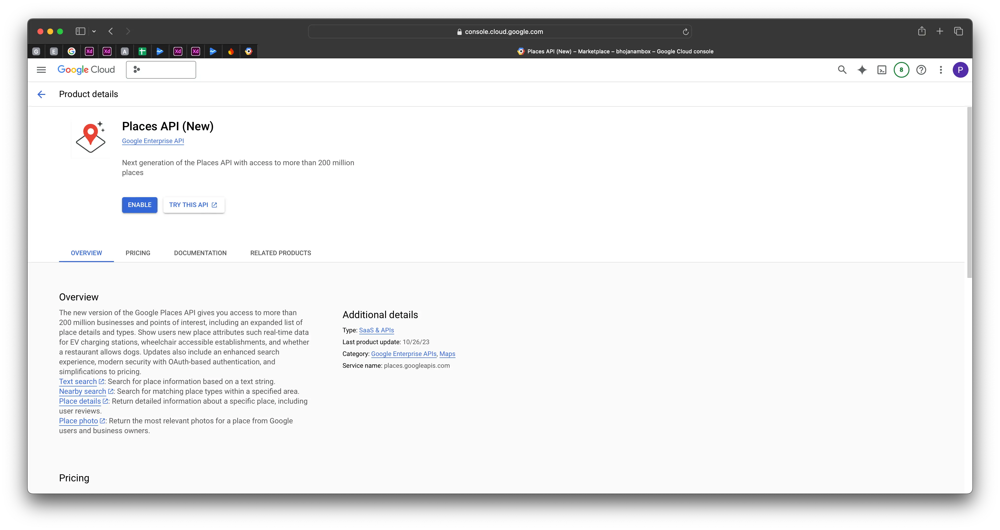
   - **Routes API** for calculating distance between locations

     :::warning
     The Distance Matrix API is now deprecated, so it's necessary to enable the Routes API.
     :::

     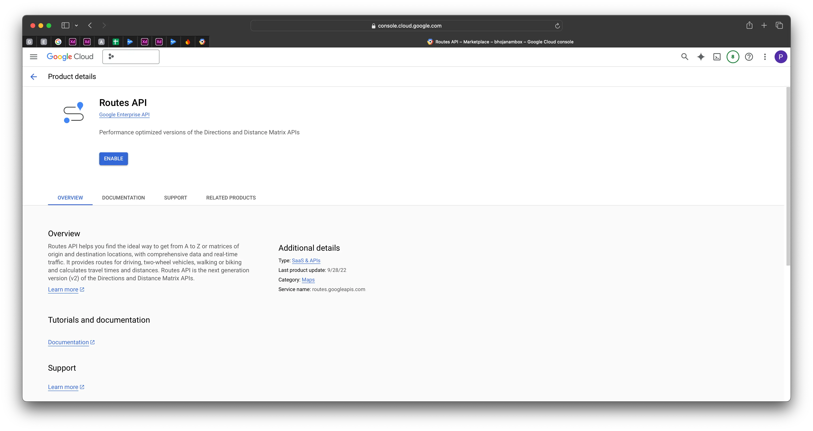
   - **Maps JavaScript API** for displaying maps

     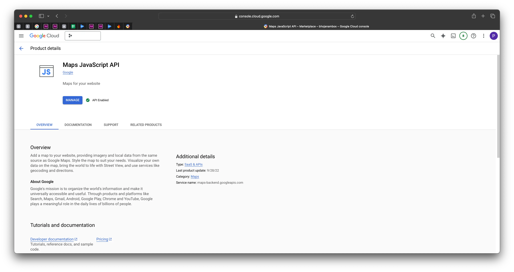

### 3️⃣ Set Up API Keys

1. In the Cloud Console, navigate to **APIs & Services > Credentials**.

   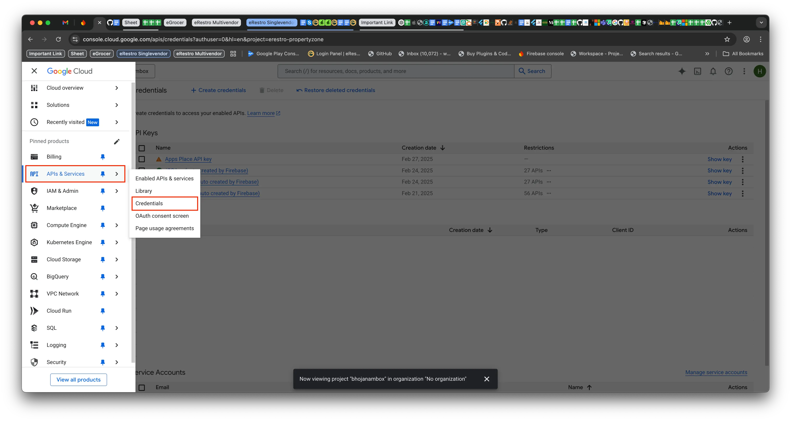

2. Click **Create Credentials** and select **API Key**.

   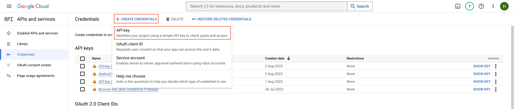

   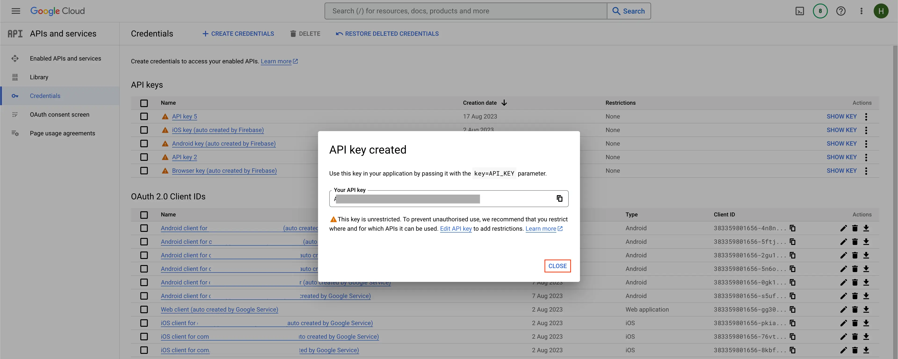

3. API Key Management for **Android**, **iOS**, and **Place Services** (remove restrictions from the newly created Android, iOS and Place Search API keys). Please ignore if already **unrestricted**.

   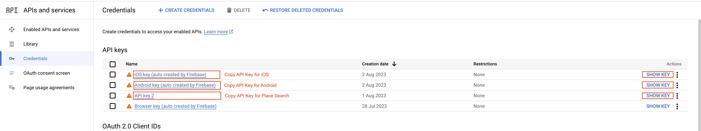

### 4️⃣ Add the API Key to Your App

1. In your Flutter app, locate the **AndroidManifest.xml** (for Android) or **AppDelegate.swift** (for iOS).
   - Insert your API key:

     ```
     <meta-data
     android:name="com.google.android.geo.API_KEY"
     android:value="YOUR_ANDROID_MAP_API_KEY" />
     ```

   - `android/app/src/main/AndroidManifest.xml`

     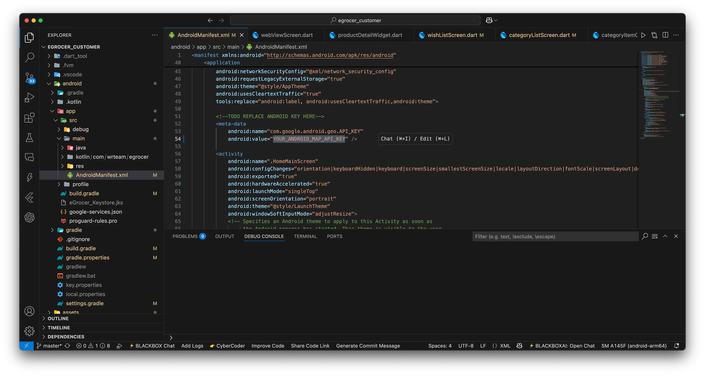

2. For iOS, add the key in **AppDelegate.swift**:

   ```
   GMSServices.provideAPIKey("YOUR_IOS_MAP_API_KEY")
   ```

   - `ios/Runner/AppDelegate.swift`

     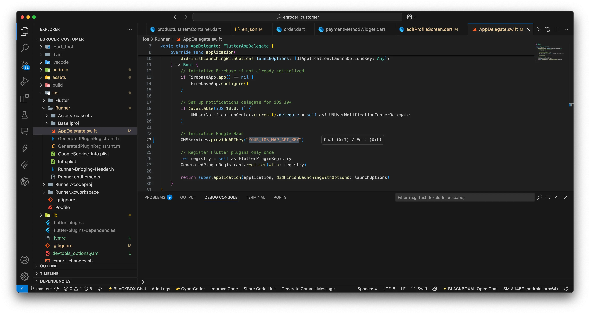

:::warning Secure your API keys
After adding your keys, **restrict them in the Google Cloud Console** so they cannot be misused if leaked:

- **Android:** Under **APIs & Services > Credentials**, edit the Android key and set **Application restrictions → Android apps**, then add your **package name** and **SHA-1 certificate fingerprint**.
- **iOS:** Edit the iOS key and set **Application restrictions → iOS apps**, then add your app's **bundle identifier**.
- For both keys, also set **API restrictions** to only the specific APIs each key needs (e.g. Maps SDK for Android/iOS, Places API).

Never ship an unrestricted API key to production.
:::

### 5️⃣ Verify Billing Setup

1. In the Cloud Console, go to **Billing** and ensure the project is linked to your billing account.
2. Test the OTP, Map, and Place APIs in your app to ensure they work properly.
