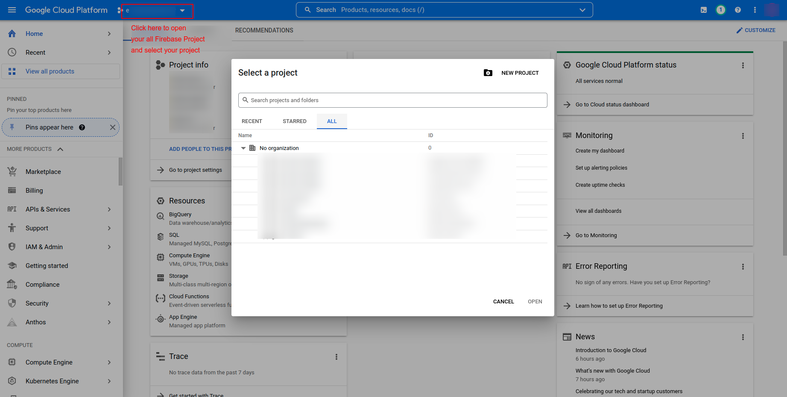
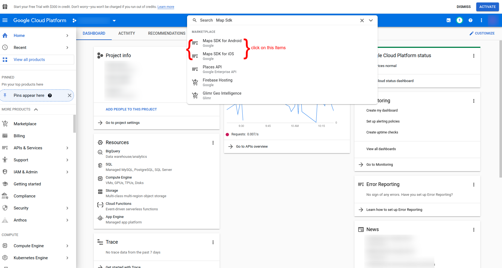
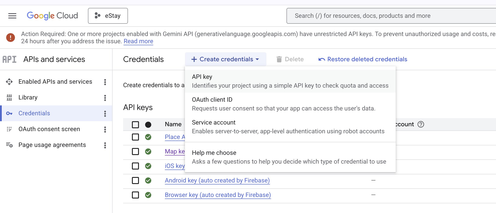

# Add Map API Key

The app uses Google Maps for showing nearby locations of property. You need a Google Cloud API key with the **Maps SDK for Android** and **Maps SDK for iOS** enabled.

## Step 1 — Open Google Cloud Console

1. Visit [https://cloud.google.com/](https://cloud.google.com/) and sign in with your Google account.
2. Click **Console** (top-right) to open the Google Cloud Console.
3. Create a new project, or select an existing one from the project picker.




## Step 2 — Enable Required APIs

In the left sidebar, go to **APIs & Services → Library**, then search for and enable the following APIs:

- **Maps SDK for Android**
- **Maps SDK for iOS**

For each one, click the API → **Enable**.





## Step 3 — Create an API Key

1. Go to **APIs & Services → Credentials**.
2. Click **+ Create Credentials → API key**.
3. Edit the newly created key. Add the APIs you enabled in Step 2. and tap Save
3. Copy the generated API key — you will paste it into the app code in the next step.




:::tip
For production, restrict the key:
- **Application restrictions** — Android apps (package + SHA-1) and iOS apps (bundle ID).
- **API restrictions** — limit to Maps SDK for Android & iOS only.
:::

## Step 4 — Paste the Key into the App

### Android — `AndroidManifest.xml`

Open `android/app/src/main/AndroidManifest.xml` and add the following `<meta-data>` tag inside the `<application>` tag:

```xml
<meta-data
    android:name="com.google.android.geo.API_KEY"
    android:value="YOUR_API_KEY_HERE"/>
```

Replace `YOUR_API_KEY_HERE` with the API key you copied in Step 3.

### iOS — `AppDelegate.swift`

Open `ios/Runner/AppDelegate.swift` and search for the following line:

```swift

    GMSServices.provideAPIKey("YOUR_API_KEY_HERE")
  
```

Replace `YOUR_API_KEY_HERE` with the same API key.

## Step 5 — Rebuild

```bash
flutter clean && flutter run
```

Maps should now load correctly on both platforms.

:::warning
Never commit your raw API key to a public repository. Use key restrictions (Step 3 tip) and consider storing the key in a non-tracked file for production builds.
:::
